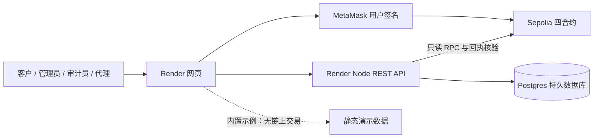
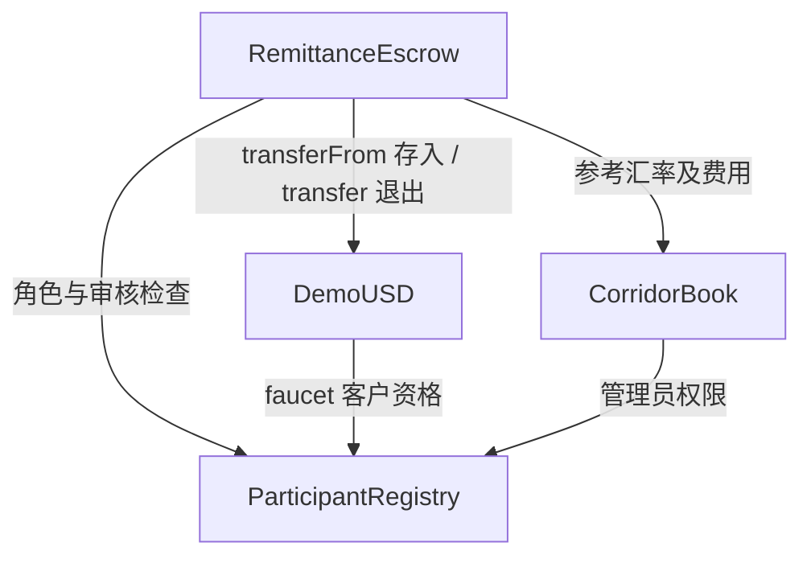
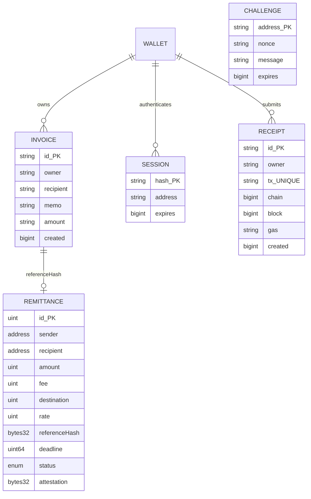
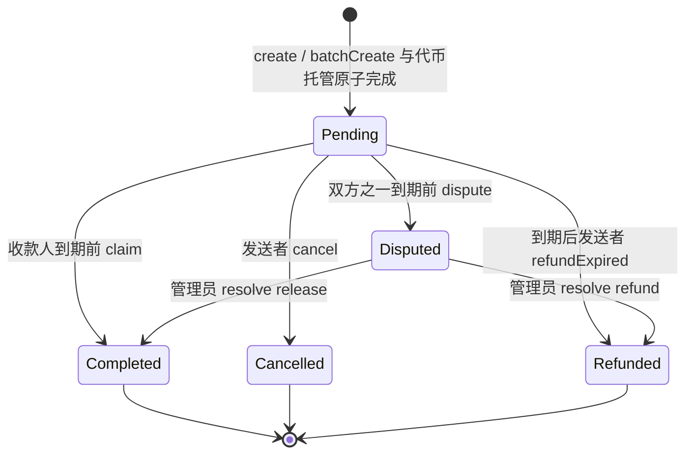
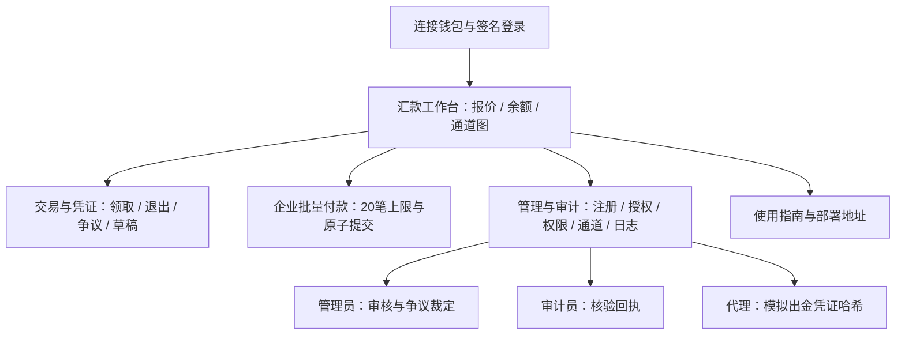

# 架构与设计图

## 系统架构

## 合约交互

## 数据模型

WALLET 是逻辑实体；钱包身份和权限实际存在合约中。数据库不包含 WALLET 或 REMITTANCE 表。INVOICE 与 REMITTANCE 的关系由随机 id 的哈希关联，无 SQL 外键。

## 汇款状态流程

Paused 只影响 create 和 batchCreate；Attested 是 Completed 的附加记录，不改变资金状态。Disputed 不存在自动到期退款，以防两条退出路径重复支付。

## 用户界面导航

金额：amount、fee 为 6 位小数 dUSD 微单位，rate 是每测试美元对应目的地币种的 6 位小数参考汇率。destination=(amount-fee)*rate/1e6，是参考额，不是链上另一币种余额。

资金不变量：托管 token 余额 = Pending 和 Disputed 的 amount 总和 + earnedFees（正常合约操作路径；外部直接捐赠 token 会使余额更大，安全审计应检查 >= 而非在所有输入下要求相等）。费用仅在完成领取或裁定放款时记账。
